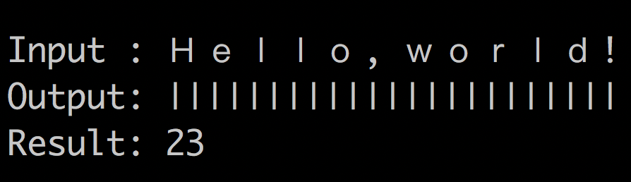

<p align="center">
  
</p>

Cross-platform single-header library to calculate the display width of UTF-8 strings

## Quick Start

```cpp
#include <unicode/display_width.hpp>

int main() {
    const std::string input = u8"Ｈｅｌｌｏ, ｗｏｒｌｄ!";
    const auto result = unicode::display_width(input);
    // result is 23
    
    // Print aligned text
    std::cout << "Input : " << input << "\n";
    std::cout << "Output: ";
    for(auto i = 0; i < result; ++i) {
        std::cout << "|";
    }
    std::cout << "\n"; 
    std::cout << "Result: " << result << "\n\n";
}
```

<p>
  
</p>
